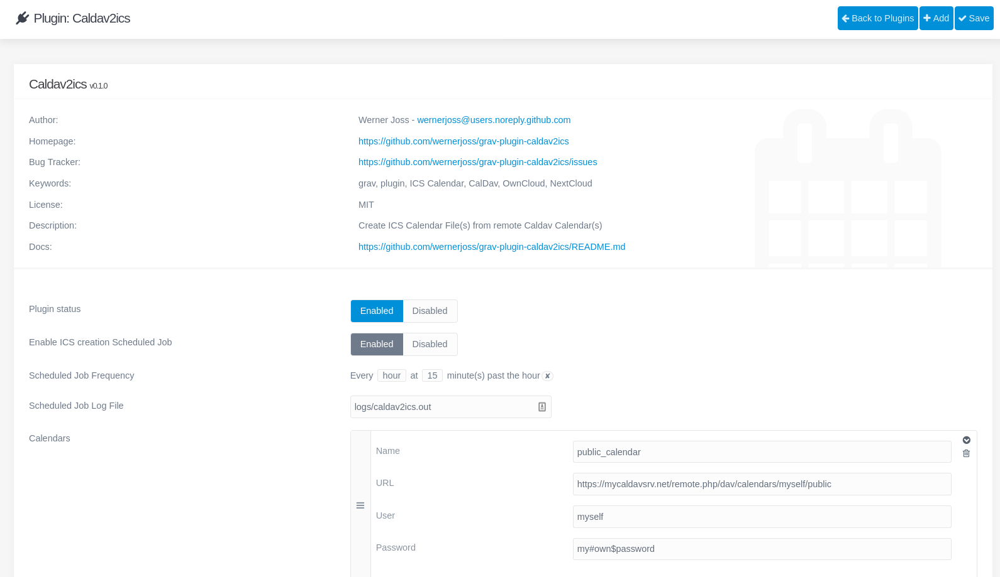

# Caldav2ics Plugin

The **Caldav2ics** Plugin is an extension for [Grav CMS](http://github.com/getgrav/grav). It creates ICS Calendar File(s) from remote Caldav Calendar(s)

**Motivation:**  
Ever thought about to use your (remote) CalDav Calendar(s) as an automatic data source for your favourite Grav Calendar Plugin ?  
Searched for a Plugin that would provide this functionality in the Grav Plugins Directory and found nothing useful ?  
Well, in case of 'Yes' to both questions, this is for You :smile:.  
The functionality of this plugin is based on my former Wordpress Plugin [wp-caldav2ics](https://wordpress.org/plugins/wp-caldav2ics/), the Configuration is fully integrated in the [Grav Scheduler](https://learn.getgrav.org/17/advanced/scheduler).  
This way, the Generation of the ICS Calendar(s) is automated to run at predefined Intervals, you can, however, also trigger this by hand in the Admin Backend (see **TODO**).

## Installation

Installing the Caldav2ics plugin can ATM only be done in one way: 

### Manual Installation

To install the plugin manually, download the zip-version of this repository and unzip it under `/your/site/grav/user/plugins`. Then rename the folder to `caldav2ics`. You can find these files on [GitHub](https://github.com/wernerjoss/grav-plugin-caldav2ics).

You should now have all the plugin files under

    /your/site/grav/user/plugins/caldav2ics
	
> NOTE: This plugin is a modular component for Grav which may require other plugins to operate, please see its [blueprints.yaml-file on GitHub](https://github.com/wernerjoss/grav-plugin-caldav2ics/blob/master/blueprints.yaml).  

## Configuration

Before configuring this plugin, you should copy the `user/plugins/caldav2ics/caldav2ics.yaml` to `user/config/plugins/caldav2ics.yaml` and only edit that copy.  
Be sure to make the file jobs/create_calendars.php executable (chmod +x) in case you edit the config file by hand - in case you use the Admin for Configuration, this will be done automatically upon save (there seems to be no way to do this upon Installation).

Here is a sample configuration for a single remote Calendar:

```yaml
enabled: true
scheduled_jobs:
  enabled: true
  at: '15 * * * *'
  logs: logs/caldav2ics.log
shebang: # leave this empty if unsure
calendars:
  -
    Name: TestCalendar
    Url: 'https://yourcaldavserver.net/remote.php/dav/calendars/myself/testcalendar'
    User: myself
    Pass: 'my#secret$password'
```

Note that if you use the Admin Plugin, a file with your configuration named caldav2ics.yaml will be saved in the `user/config/plugins/`-folder once the configuration is saved in the Admin.  
In Addition, Configuration via the Admin is much easier than by editing the config file, as this has a nice, (hopefully) self-explaining UI, so you should really use this, at least for a Start :smile:.  


## Usage
Once installed, you should at first enable the Grav Scheduler (if not already done) - see [the official docs](https://learn.getgrav.org/17/advanced/scheduler).  
From this point, all you need to do is correctly fill out the Form in the Admin for the caldav2ics Plugin and then enable the created Job in the Scheduler.  
This should be rather self-explanatory, as already stated.  
It is, however, not always that easy to correctly determine the URL of remote CalDav Calendars, although most commonly used Incarnations (such as OwnCloud, NextCloud...) provide extra Links for that - in case of difficulties, you may consider using [this script](https://github.com/wernerjoss/caldav2ics/blob/master/caldavexplore.sh) to find out.  
Also note that it is not only necessary to enable the Plugin itself, but also the scheduled_jobs (see Configuration).  
Once the Configuration is saved, the ICS Generation process should run at the desired time schedule, a good idea is always to check the Logfile.  
Hint: if this does not happen after the first Save in the Admin, just save the Configuration once more and it should be ok (not sure why this is sometimes necessary).  

## Hints
This Plugins is currently tested and proved to work in a local Grav docker Instance as well as a local LAMP Server (Debian buster) and my own Website.
As said, it requires cron access for the Server's www user (mostly www-data).  
before saving the plugin configuration (remote calendar data..), please check if the default PHP shebang 
  #!/usr/bin/php
is correct for your Webserver, if not, it will be detected automatically, only in case this detection fails (can be seen in the logs): correct it, otherwise the Plugin will NOT work (note the Tooltip).  
In case you do not have cron access on your webserver (so, Grav Scheduler not functional), but some other possibility to run a single php script periodically, you may want to use the [standalone caldav2ics](https://github.com/wernerjoss/caldav2ics) for the same functionality.  
In this case, you can use this Plugin as a graphical Frontend to easily create a config file (user/data/calendars/calendars.yaml) for the mentioned standalone script.
Additionally, there is even a scenario to run this Plugin automatically on a local Server and then push the created ICS File(s) to your production Server - this can also be done automatically via crontab, e.g. with ncftp (ncftp can upload Files automatically without user intervention).  
Also be aware that the recommended way to configure this plugin is to use the Grav Admin Backend, as this ensures all necessary file/directory creation is done via the webserver user account, so, in case of manual installation and configuration, make sure all plugin files/directories, as well as user/data and user/config are readable and writable by that user.

## Dependencies
Here is a short list which shows what is necessary to run this Plugin:
-	Grav CMS V 1.7.x
-	cron access for the www-user on the Server
-	Grav Scheduler enabled
-	php-curl

## TODO
- create Calendars via internal function, instead of external PHP file create_calendars.php
- allow configurable Path for created ICS Files (currently hardcoded to user/data/calendars)
- evtl. Trigger ICS Generation via Button in the Admin
